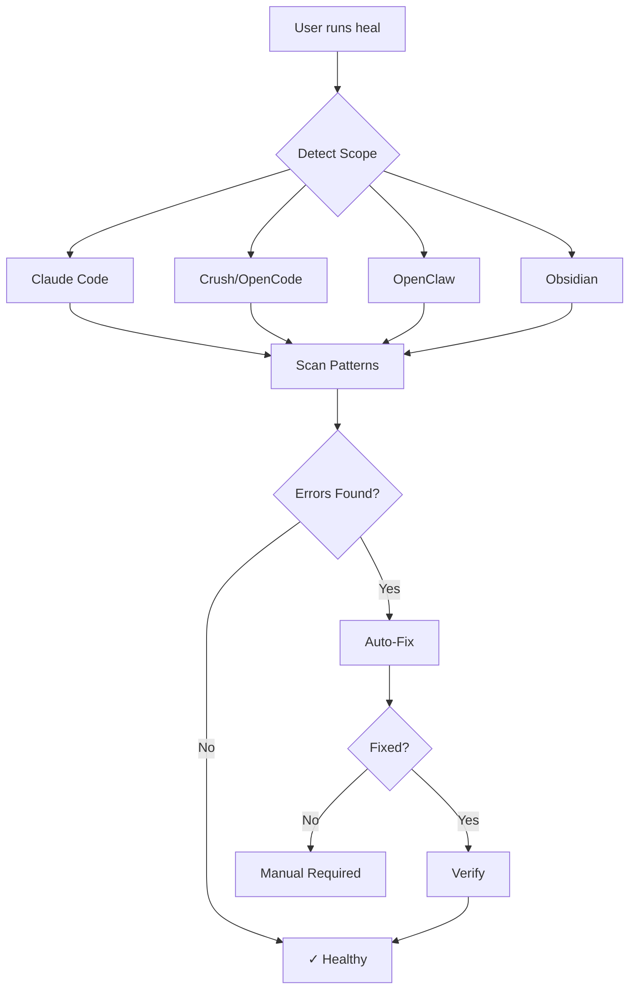
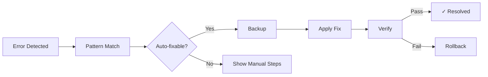
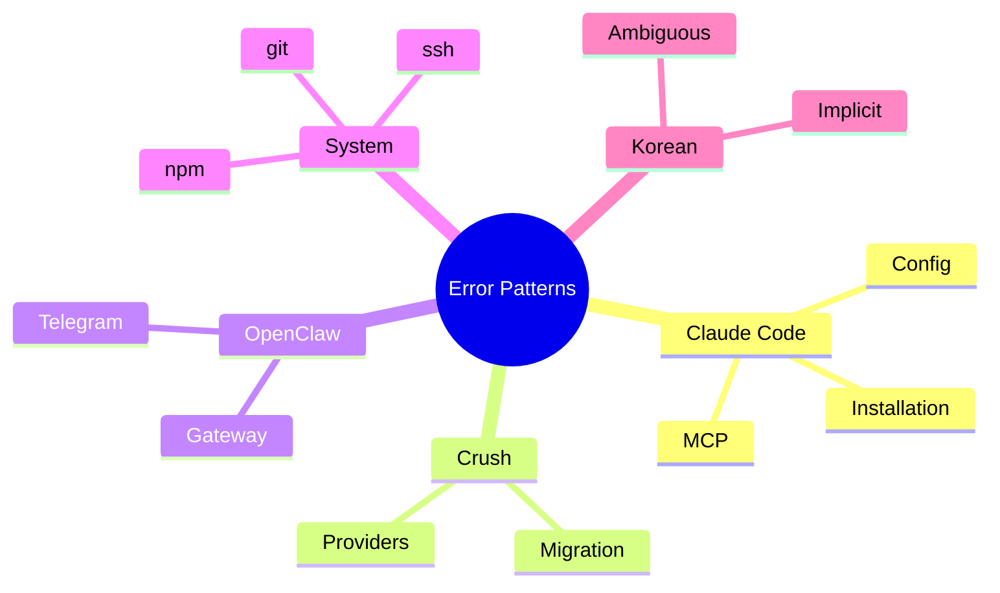

# Screenshot Generation Prompts

Use these prompts with image generation tools (Midjourney, DALL-E, etc.) or terminal recording tools (asciinema, terminalizer).

---

## Terminal Screenshots (Use asciinema or terminalizer)

### 1. Hero Shot - `heal` Command
```bash
# Record this sequence
cd ~/claude-error-prevention
./src/error-engine.sh heal
```

**Expected output visual:**
- Colorful terminal with scope detection
- Progress indicators
- Green checkmarks for fixes
- Final summary box

---

### 2. Search Demo
```bash
./src/error-engine.sh search "mcp"
```

**Expected visual:**
- Blue info header
- Green tool badges [claude-code], [opencode]
- Error messages with fixes

---

### 3. Scope Detection
```bash
./src/error-engine.sh scope
```

**Expected visual:**
- List of detected tools
- Version numbers
- Checkmarks for each scope

---

## Diagram Prompts (Use Mermaid, Excalidraw, or draw.io)

### 4. Architecture Flowchart


---

### 5. Error Resolution Flow


---

### 6. Pattern Categories Diagram


---

## Badge/Icon Prompts

### 7. Logo Concept
```
Prompt: Minimalist shield icon with a checkmark, representing error prevention.
Colors: Blue (#0066CC) and green (#00CC66)
Style: Flat, modern, developer-friendly
Size: 128x128 PNG with transparency
```

### 8. Status Badges
```
Generate SVG badges:
- "67 patterns" (blue)
- "45+ auto-fix" (green)  
- "v2.6" (orange)
- "macOS/Linux" (gray)
```

---

## ASCII Art (For Terminal)

### 9. Welcome Banner
```
 _____ ____  ____   ___  ____  
| ____|  _ \|  _ \ / _ \|  _ \ 
|  _| | |_) | |_) | | | | |_) |
| |___|  _ <|  _ <| |_| |  _ < 
|_____|_| \_\_| \_\\___/|_| \_\
                               
 ____  ____  _____ _   _ _____ _   _ _____ ___ ___  _   _ 
|  _ \|  _ \| ____| | | | ____| \ | |_   _|_ _/ _ \| \ | |
| |_) | |_) |  _| | | | |  _| |  \| | | |  | | | | |  \| |
|  __/|  _ <| |___| |_| | |___| |\  | | |  | | |_| | |\  |
|_|   |_| \_\_____|\___/|_____|_| \_| |_| |___\___/|_| \_|

v2.6 - 67 patterns - Zero configuration
```

---

## Recording Commands (asciinema)

```bash
# Install asciinema
brew install asciinema

# Record heal command
asciinema rec -t "error-prevention-heal" heal-demo.cast

# Inside recording:
./src/error-engine.sh heal

# Upload
asciinema upload heal-demo.cast
```

---

## Terminalizer Config

```yaml
# terminalizer.yml
cols: 120
rows: 30
theme: 
  background: "#1e1e1e"
  foreground: "#d4d4d4"
frameDelay: 100
maxIdleTime: 2000
```

---

## Social Media Preview

```
Prompt: Open Graph image for GitHub repository
Size: 1280x640
Content:
  - Title: "AI Agent Error Prevention"
  - Subtitle: "67 patterns • 45+ auto-fixes • Zero config"
  - Visual: Terminal window showing colorful output
  - Logo: Shield with checkmark
Colors: Dark background (#0d1117) with syntax highlighting colors
```
